<h2 align="center"><a href="https://atifsimsek.github.io/html-css-js-projects/Html-Css-Js%20WebSite%20Project/10%20-%20Barber%20Website%20%2BJs/index.html">Click To Review</a> </h2>

<h3 align="center">Website İmages</h3>

 

 

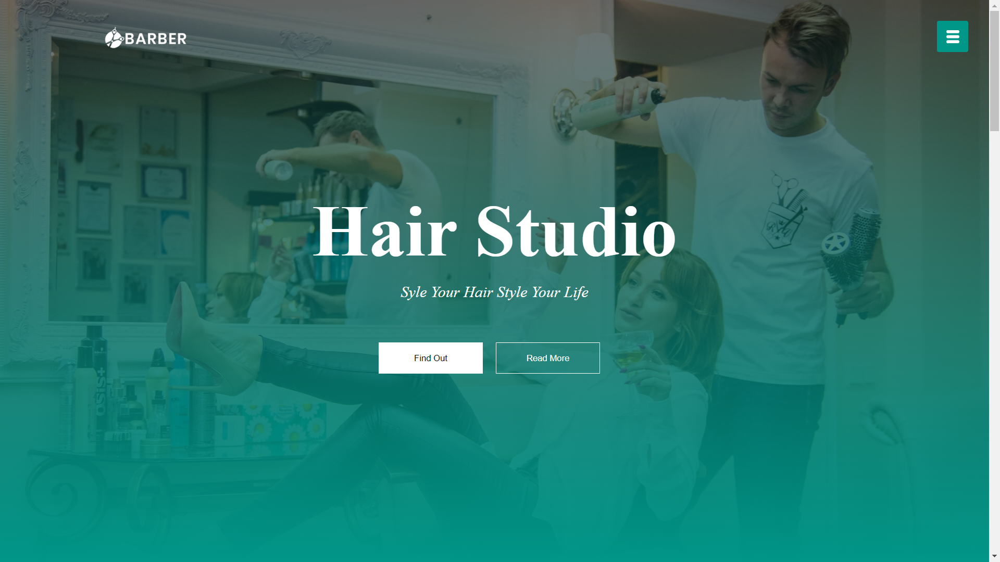

 

---

 

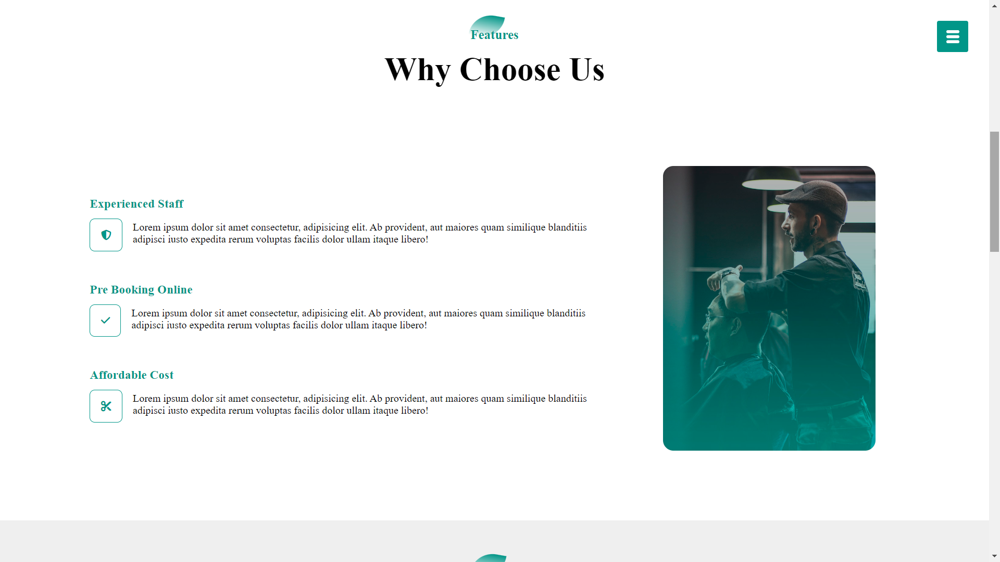

 

---

 

 

---

 

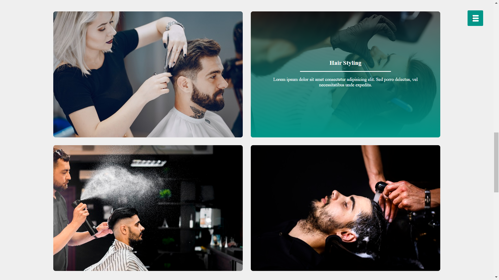

 

---

 

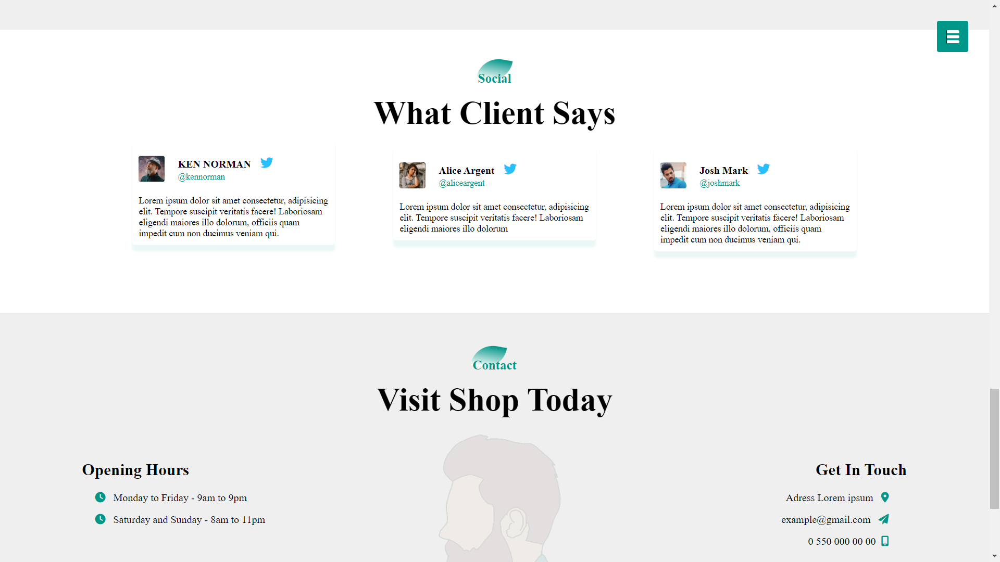

 

---

 

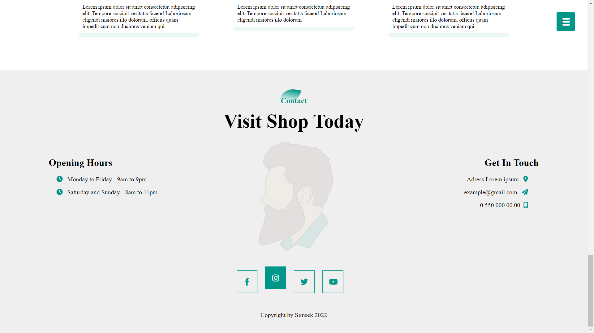

 

---

 

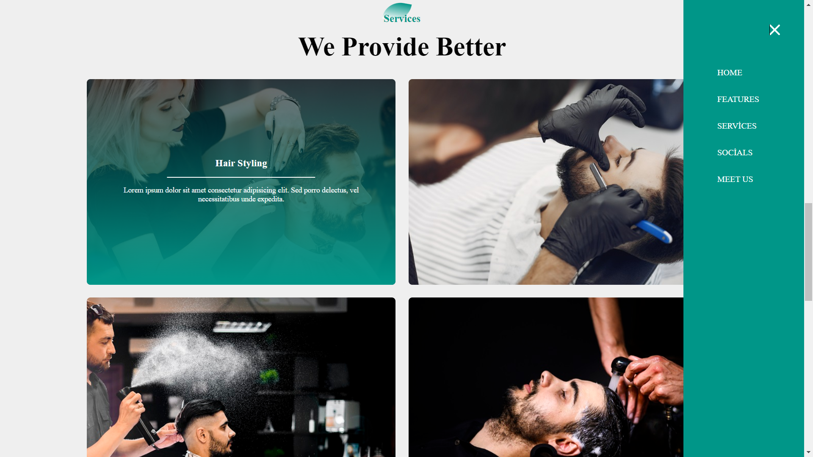

 
 

<h3 align="center">Tablet Version İmages</h3>

 

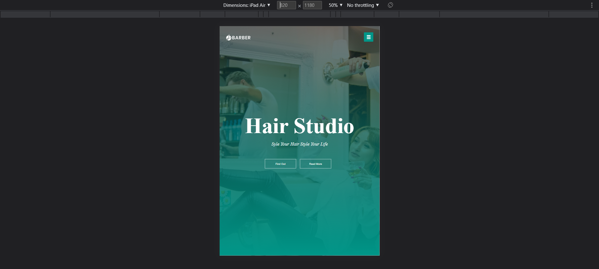

 

---

 

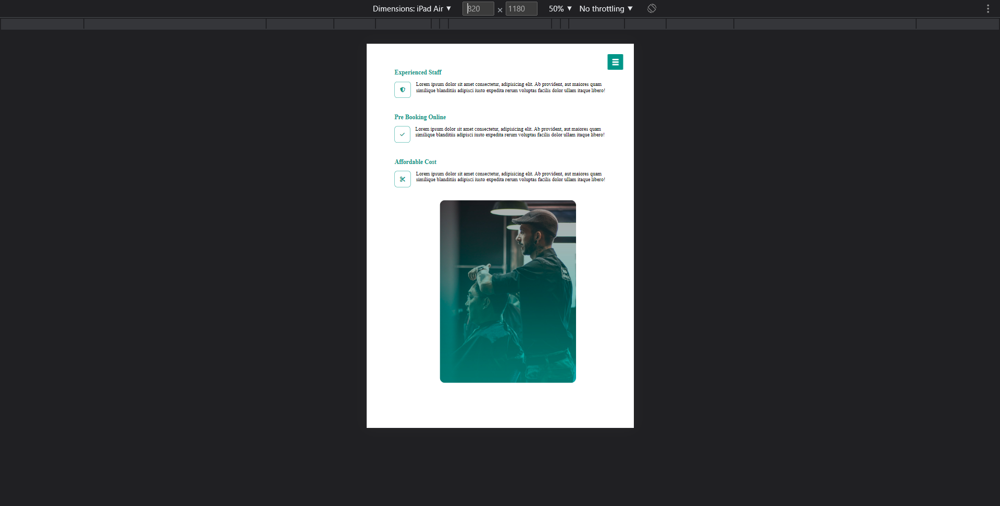

 

---

 

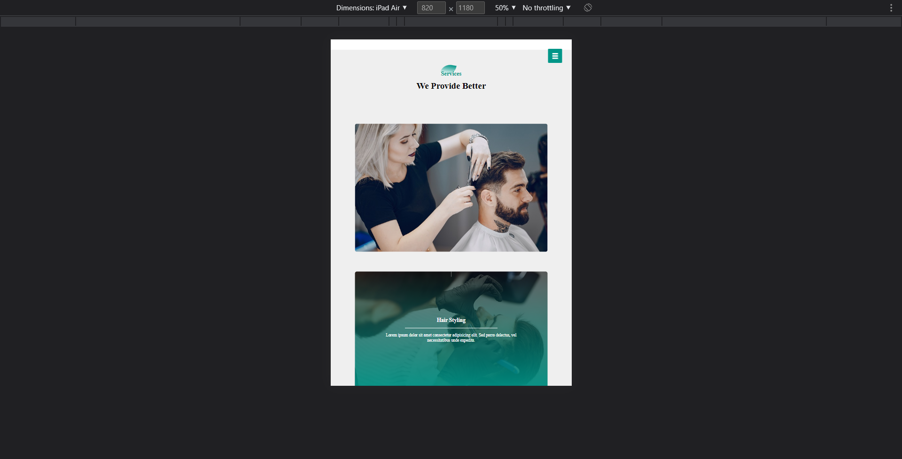

 

---

 

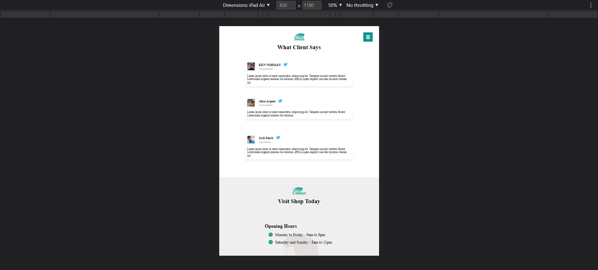

 

---

 

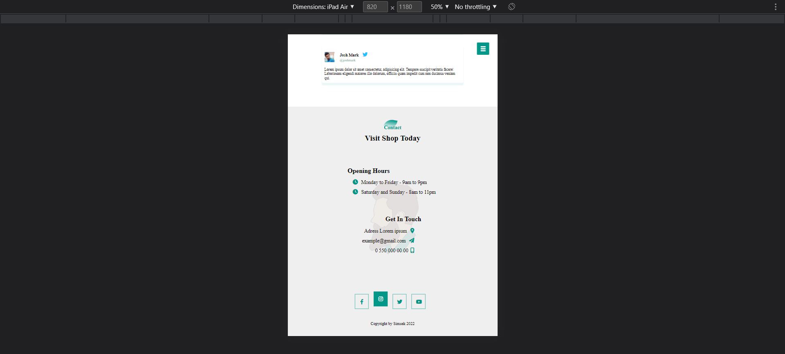

 

---

 

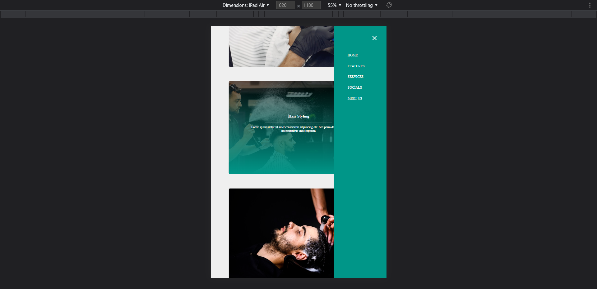

 
 

<h3 align="center">Mobile Version İmages</h3>

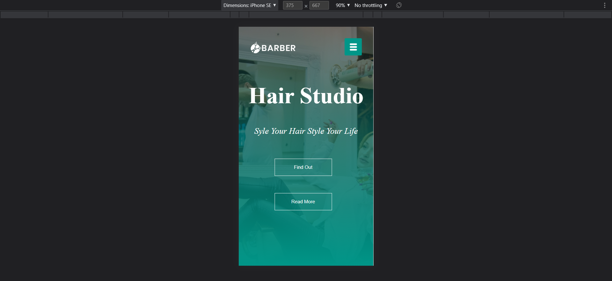

 

---

 

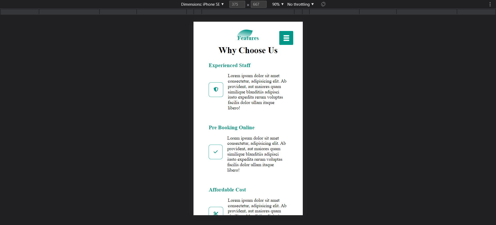

 

---

 

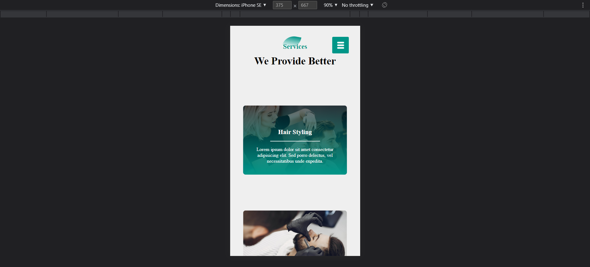

 

---

 

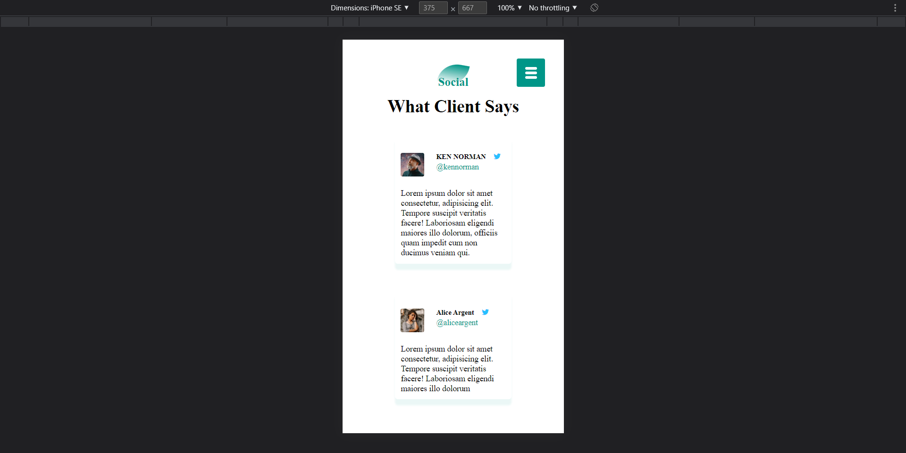

 

---

 

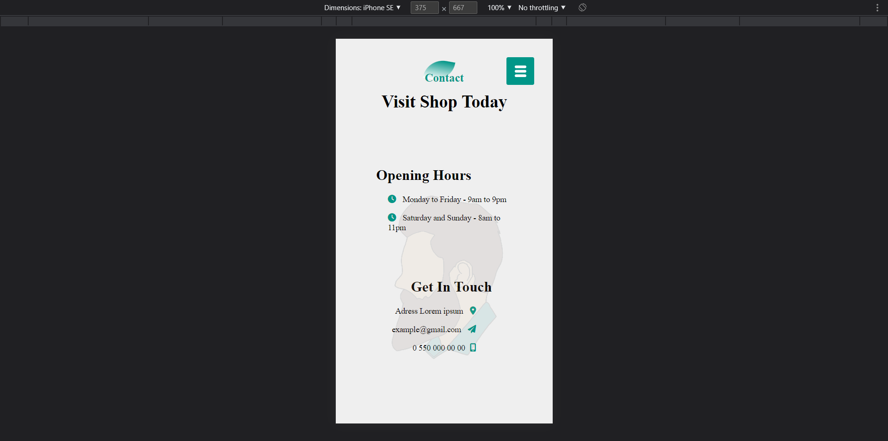

