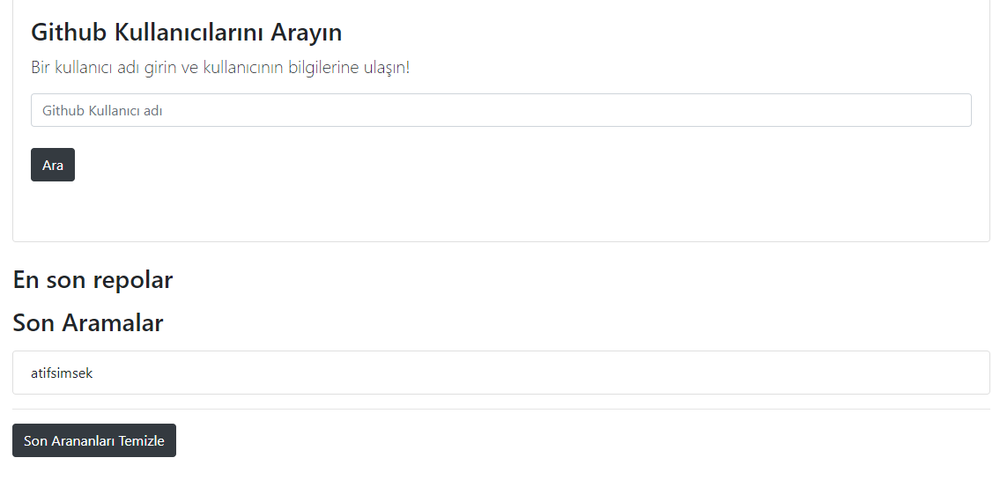
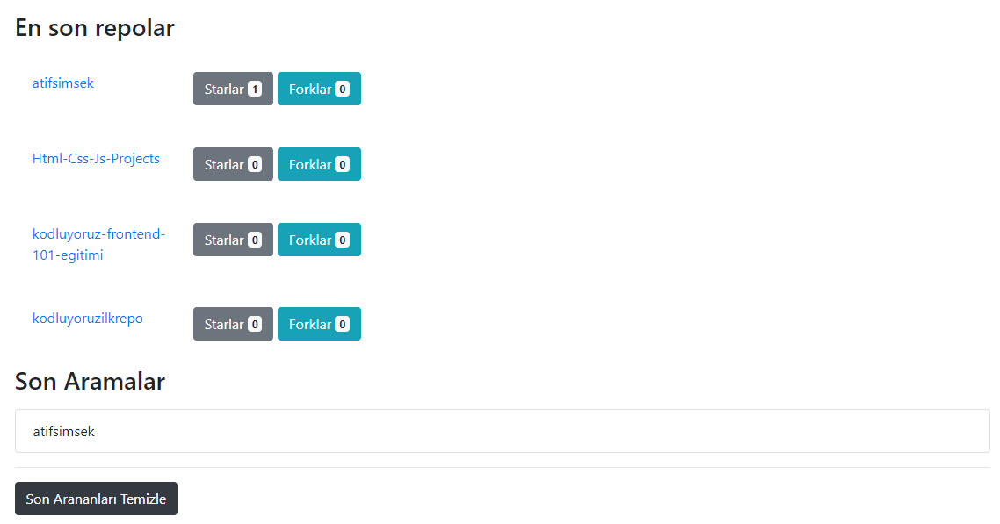

<h2 align="center"><a href="https://atifsimsek.github.io/Html-Css-Js-Projects/JavaScript%20Project/05%20-%20Githup%20Rest-API/index.html">Click To Review</a> </h2>

<h3 align="center">Project İmages</h3>
 

 

---

 

---

 

