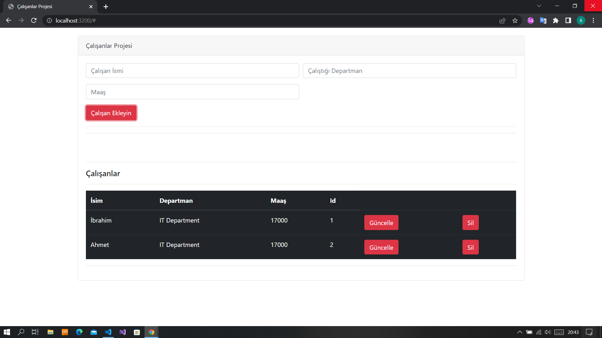
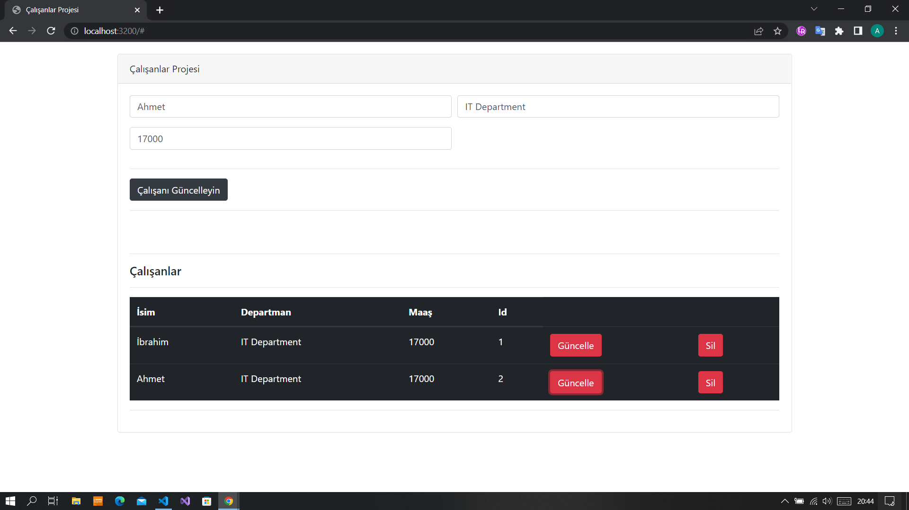

# Employee Project # 

## Employee Project steps to run ##

1. Open a new terminal ,Complete 2 installations by saying npm install, npm run build.

2. bundelle.js file add to index.html.

3. And to make ourselves an Local Host,we will download an npm package.

4. "npm instal -g json-server" We are downloading with the command.

5. Create a file named fake-api

6. we create our json file inside the fake-api.

7. And open the two terminal, in the first terminal - npm run start and in the other terminal we type json-server --watch fake-api/(your file name). 
**use cmd terminal**

ps:

You will have any questions, you can contact me.
 

## Project Images and properties ##

---
 

---
 

 

- Get,Post,Put,Delete requests were  made witdh fetch.

- Adding new employees, deleting updates, is done on both the ui side and the local hosting side.

The project  cloned for practing. You can find the original repo of the project [here](https://github.com/mustafamuratcoskun/jsonserver-webpack-project)

 

